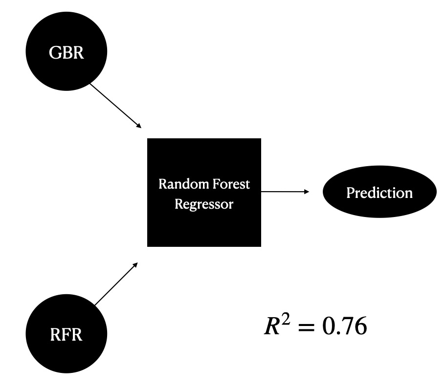
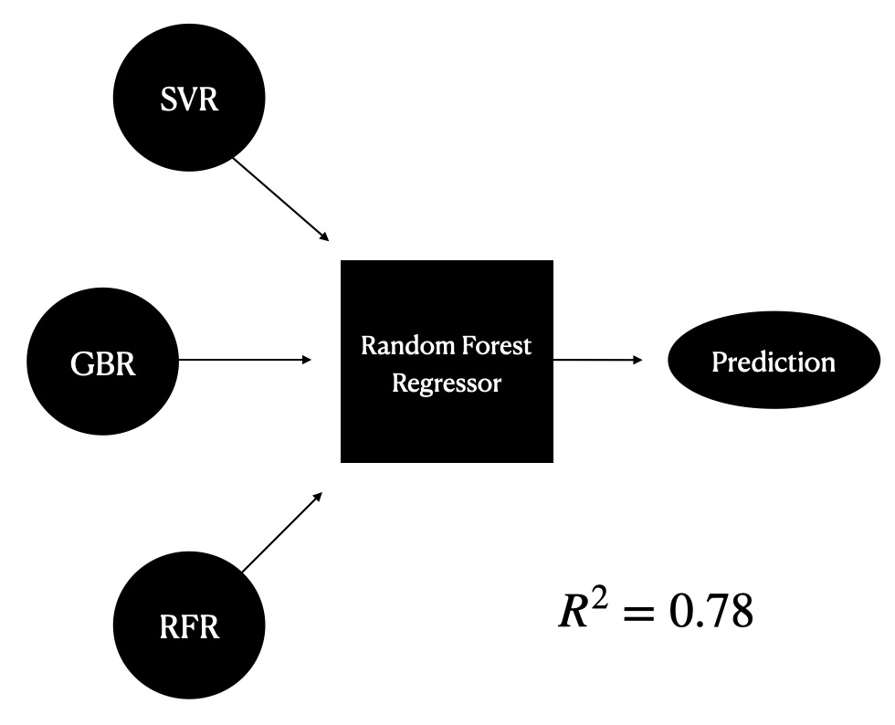

# ML_EBGEstimate
## Introduction

Our project aims to develop a machine learning model for predicting various properties of materials. While there are existing projects that focus on predicting specific properties, such as band gap in 2D materials or organic or perovskite materials, our project aims to develop a more general model that can predict a wide range of properties for any given material. Our ultimate goal is to create a tool that can be used by materials scientists to predict properties of new materials that have not yet been synthesized or characterized.

## Dataset

Our models were trained on the following datasets.

-   Computational 2D Materials Database (C2DB)
- Joint Automated Repository for Various Integrated Simulations (JARVIS) 

## Algorithms

We built several types of algorithms to achieve our goal:

-   Classification (Decision Tree Classifier, Logistic Regression, Random Forest Classifier, Support Vector Classifier)
-   Regression (Support Vector Regression, Random Forest Regressor, Gradient Boosted Decision Trees)
-   Clustering (DBSCAN)
-   Ensemble methods (Stacked Generalization)

## Results so far...

Our algorithms achieved the following results:

-   Classification algorithms have >70% accuracy
-   Regression algorithms have an R2 > 0.72
-   Clustering algorithm gave a reasonable number of clusters for future applications
-   Gradient boosted decision trees (GBDTs) and random forests (RFs) are more effective in learning material properties, with GBDTs and RFs having an R2 value of 0.92 and 0.90 respectively.

